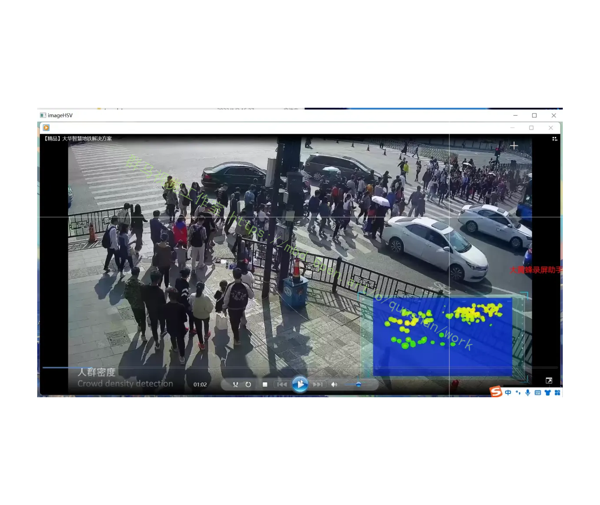
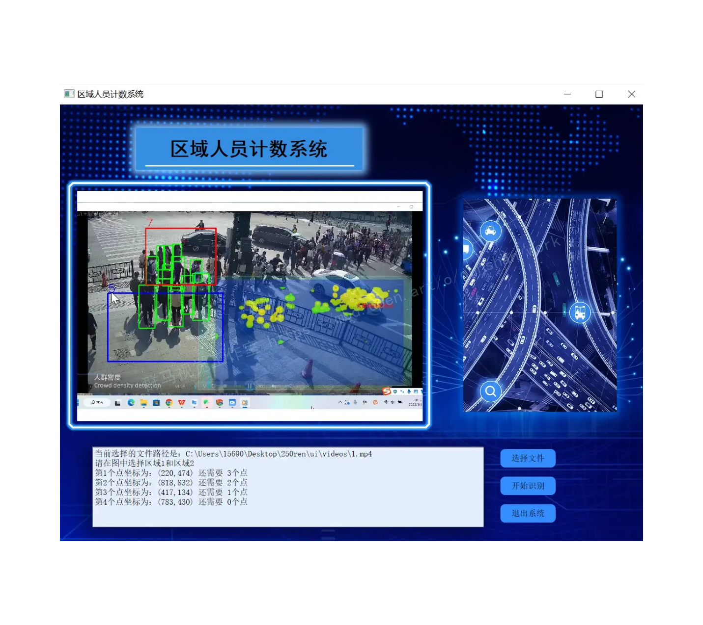
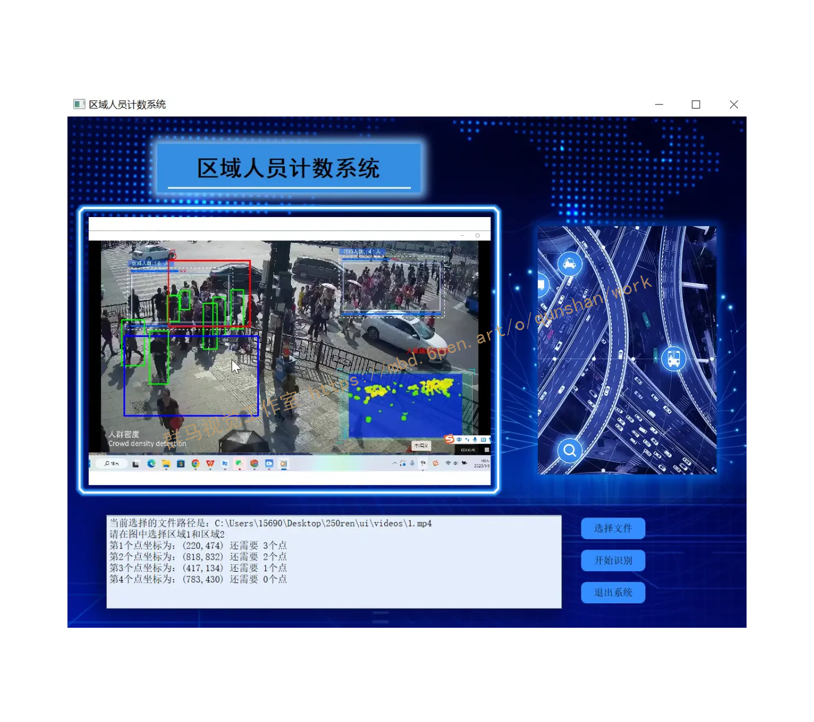
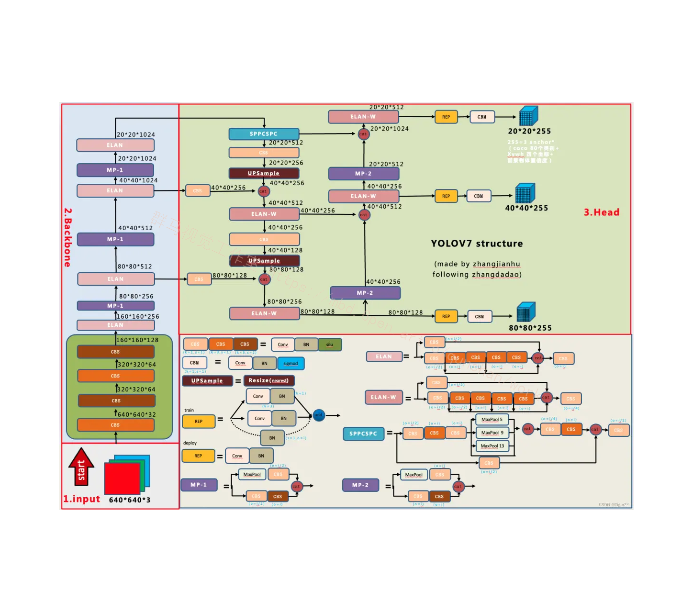
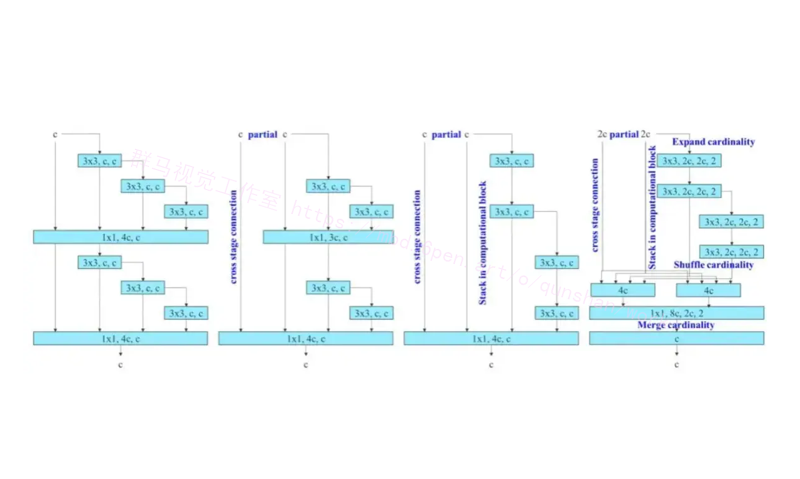
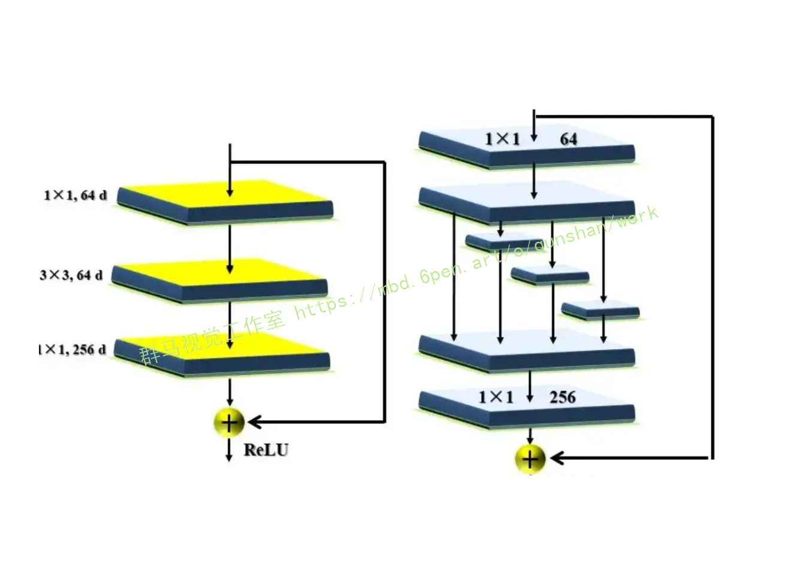
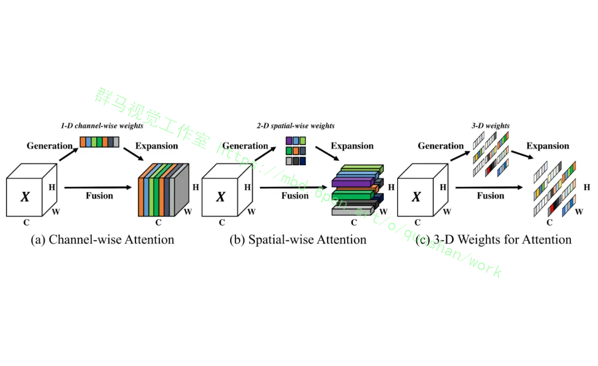
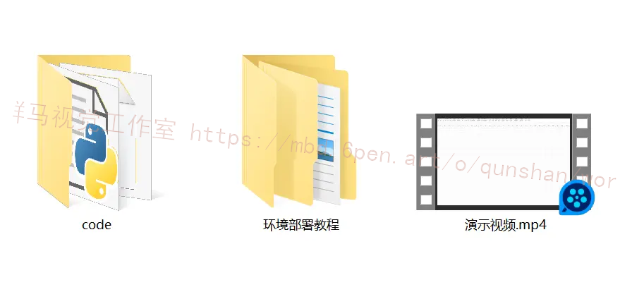



## 1.研究背景与意义


随着人工智能和计算机视觉的快速发展，人员计数系统在各个领域中变得越来越重要。从零售业到交通管理，从安防监控到人流分析，人员计数系统可以提供有价值的数据和信息，帮助决策者做出更好的决策。

然而，传统的人员计数系统往往面临一些挑战。首先，传统的基于传感器的人员计数系统需要大量的设备和布线工作，增加了系统的复杂性和成本。其次，传统的计数方法通常基于简单的规则和算法，对于复杂的场景和变化的环境往往效果不佳。此外，传统的计数系统往往需要人工干预和校正，耗费时间和人力资源。

为了解决这些问题，本研究提出了一种基于深度学习的区域人员计数系统，利用Python编程语言实现。深度学习是一种机器学习的方法，通过模拟人脑神经网络的结构和功能，可以从大量的数据中学习和提取特征，从而实现更准确和智能的计数。

本研究的主要目标是开发一个简单易用、高效准确的人员计数系统，可以在各种场景下使用。具体来说，本研究的贡献包括以下几个方面：

1. 开发基于深度学习的人员计数算法：本研究将利用深度学习的方法，通过训练神经网络模型，实现对人员的准确计数。深度学习的优势在于可以自动学习和提取特征，适应不同的场景和环境。

2. 设计区域人员计数系统的架构：本研究将设计一个完整的区域人员计数系统的架构，包括数据采集、特征提取、模型训练和计数输出等模块。系统将采用Python编程语言实现，具有良好的可扩展性和易用性。

3. 提供部署教程和源码：为了方便其他研究者和开发者使用和扩展本研究的成果，我们将提供详细的部署教程和源码。通过这些资源，其他人可以快速理解和使用本研究的方法和系统。

本研究的意义在于提供了一种新的、基于深度学习的人员计数系统，可以应用于各种领域和场景。与传统的计数方法相比，本系统具有更高的准确性和智能性，可以更好地满足实际需求。此外，通过提供部署教程和源码，本研究还可以促进相关领域的研究和应用的发展。

总之，本研究旨在开发一种基于深度学习的区域人员计数系统，通过Python编程语言实现，并提供详细的部署教程和源码。该系统具有重要的实际应用价值，可以在各个领域中提供有价值的数据和信息，帮助决策者做出更好的决策。

# 2.图片演示







# 3.视频演示
https://www.bilibili.com/video/BV1Rp4y1P7S6/?vd_source=ff015de2d29cbe2a9cdbfa7064407a08

# 4.YOLOv7模型
  按照论文，目前模型精度和推理性能比较均衡的是yolov7 模型(对应的开源git版本为0.1版)。根据源码+导出的onnx文件+“张大刀”等的网络图（修改了其中目前我认为的一些bug，增加一些细节）。重新绘制了yoloV7 0.1版本的非常详尽网络结构。注意：

 1）其中的特征图结果维度注释是按照箭头的流方向，不是固定的上下方向。

2）输入输出仅仅是指当前模块的输入输出，整体需要根据流方向累乘计算最终的结果。

3）该模型版本没有辅助训练头。

整体上和YOLOV5是相似的，主要是网络结构的内部组件的更换（涉及一些新的sota的设计思想）、辅助训练头、标签分配思想。



## 5.核心代码讲解

#### 5.1 check_img.py

以下是将上述代码封装为一个类的核心部分：

```python
import cv2
import numpy as np
import os

class ImageProcessor:
    def __init__(self, path, train_file):
        self.path = path
        self.train_file = train_file
        self.num = 0

    def process_images(self):
        result = os.listdir(self.path)
        if not os.path.exists(self.train_file):
            os.mkdir(self.train_file)
        for i in result:
            try:
                image = cv2.imread(self.path + '/' + i)
                cv2.imwrite(self.train_file + '/' + 'Compressed' + i, image, [int(cv2.IMWRITE_JPEG_QUALITY), 100])
                self.num += 1
            except:
                pass
        print('数据有效性验证完毕,有效图片数量为 %d' % self.num)
        if self.num == 0:
            print('您的图片命名有中文，建议统一为1（1）.jpg/png')
```

这样，你可以通过创建一个`ImageProcessor`对象，并调用`process_images`方法来处理图片。

该程序文件名为check_img.py，主要功能是对指定文件夹中的图片进行降噪和压缩处理。

程序首先导入了cv2、numpy和os模块。cv2是OpenCV库，用于图像处理；numpy是Python的数值计算库；os是用于操作文件和目录的模块。

程序定义了一个路径变量path，指定了存放需要处理的图片的文件夹路径。然后使用os模块的listdir函数获取该文件夹下的所有文件名，并将结果保存在result变量中。

接下来定义了一个存放处理后图片的文件夹路径train_file，并使用os模块的mkdir函数创建该文件夹（如果不存在）。

然后使用一个循环遍历result中的每个文件名。在循环中，程序尝试使用cv2模块的imread函数读取当前文件名对应的图片，并将结果保存在image变量中。

然后使用cv2模块的imwrite函数将处理后的图片保存到train_file文件夹中，文件名为'Compressed' + 当前文件名，保存格式为JPEG，压缩质量为100。

循环结束后，程序输出数据有效性验证完毕，并显示有效图片数量。

最后，程序判断有效图片数量是否为0，如果是，则输出建议统一图片命名为'1（1）.jpg/png'，否则程序结束。

#### 5.2 cut_hsv_range.py

```python

class ImageProcessor:
    def __init__(self, image_path):
        self.image = cv2.imread(image_path)
        self.imagecopy = self.image.copy()
        self.list1 = []
        self.list2 = []
        self.num = 0

    def resize_image(self):
        self.image = cv2.resize(self.image, (0, 0), fx=1, fy=1, interpolation=cv2.INTER_NEAREST)
        self.image = cv2.cvtColor(self.image, cv2.COLOR_BGR2HSV)

    def getpos(self, event, x, y, flags, param):
        if event == cv2.EVENT_MOUSEMOVE:
            HSV = self.HSV2.copy()
            cv2.line(HSV, (0, y), (HSV.shape[1]-1, y), (255, 255, 255), 1, 4)
            cv2.line(HSV, (x, 0), (x, HSV.shape[0] - 1), (255, 255, 255), 1, 4)
            cv2.imshow("imageHSV", HSV)
        elif event == cv2.EVENT_LBUTTONDOWN:
            self.num += 1
            HSV = self.HSV2.copy()
            if self.num == 1:
                self.list1.append([x, y])
                print('请点击HSV图片上第二个点')
            if self.num == 2:
                self.num = 0
                self.list2.append([x, y])
                hlist = []
                slist = []
                vlist = []
                for i in range(min(self.list1[-1][0], self.list2[-1][0]), max(self.list1[-1][0], self.list2[-1][0])):
                    for j in range(min(self.list1[-1][1], self.list2[-1][1]), max(self.list1[-1][1], self.list2[-1][1])):
                        hlist.append(self.HSV[j, i][0])
                        slist.append(self.HSV[j, i][1])
                        vlist.append(self.HSV[j, i][2])
                hlist.sort()
                slist.sort()
                vlist.sort()
                print(hlist)
                print(slist)
                print(vlist)
                print('请点击HSV图片上第一个点')
                print((hlist[0], slist[0], vlist[0]), (hlist[-1], slist[-1], vlist[-1]))

    def process_image(self):
        self.resize_image()
        self.HSV = self.image.copy()
        self.HSV2 = self.image.copy()
        cv2.imshow("imageHSV", self.HSV)
        cv2.setMouseCallback("imageHSV", self.getpos)
        cv2.waitKey(0)

```

这个程序文件名为cut_hsv_range.py，它的功能是通过在HSV图像上选择两个点，确定一个矩形范围，并计算该范围内的像素的HSV值的最小值和最大值。

程序首先导入了cv2、numpy和matplotlib.pyplot库。然后，它读取了一个名为'./chess/6.png'的图像，并创建了一个图像的副本。

接下来，程序进入一个循环，直到用户选择了两个点。在每次循环中，程序会调整图像的尺寸，并将图像从BGR颜色空间转换为HSV颜色空间。然后，程序复制了一份HSV图像。

程序定义了一个getpos函数，用于处理鼠标事件。当鼠标移动时，程序会在HSV图像上绘制一条水平和垂直线，并显示更新后的图像。当鼠标左键按下时，程序会记录下鼠标点击的坐标，并根据这两个点确定一个矩形范围。然后，程序会遍历该范围内的像素，并将其HSV值分别存储在hlist、slist和vlist列表中。最后，程序会对这些列表进行排序，并打印出最小值和最大值。

程序会在窗口中显示HSV图像，并等待用户选择两个点。用户可以通过点击鼠标左键选择第一个点，然后再次点击鼠标左键选择第二个点。完成选择后，用户可以按任意键退出程序。

注意：程序中的路径'./chess/6.png'是示例路径，需要根据实际情况进行修改。


#### 5.3 torch_utils.py

```python

try:
    import thop  # for FLOPs computation
except ImportError:
    thop = None

LOGGER = logging.getLogger(__name__)


@contextmanager
def torch_distributed_zero_first(local_rank: int):
    """
    Decorator to make all processes in distributed training wait for each local_master to do something.
    """
    if local_rank not in [-1, 0]:
        dist.barrier(device_ids=[local_rank])
    yield
    if local_rank == 0:
        dist.barrier(device_ids=[0])


def date_modified(path=__file__):
    # return human-readable file modification date, i.e. '2021-3-26'
    t = datetime.datetime.fromtimestamp(Path(path).stat().st_mtime)

```
这个程序文件是一个PyTorch工具文件，主要包含了一些与PyTorch相关的实用函数和类。下面是文件中的一些主要部分：

1. 导入所需的库和模块。
2. 定义了一个上下文管理器`torch_distributed_zero_first`，用于在分布式训练中使所有进程等待每个本地主进程执行某些操作。
3. 定义了一个函数`date_modified`，用于返回文件的最后修改日期。
4. 定义了一个函数`git_describe`，用于返回当前代码所在的Git仓库的描述信息。
5. 定义了一个函数`select_device`，用于选择使用的设备（CPU或GPU）。
6. 定义了一个函数`time_sync`，用于获取PyTorch准确的时间。


## 6.系统整体结构

整体功能和构架概述：
该项目是一个目标检测系统，使用YOLOv7模型进行目标检测。它包含了训练、推理和界面展示等功能。整体构架包括了模型定义、数据处理、训练、推理和界面展示等模块。

下面是每个文件的功能概述：

| 文件路径 | 功能概述 |
| --- | --- |
| check_img.py | 对指定文件夹中的图片进行降噪和压缩处理 |
| cut_hsv_range.py | 在HSV图像上选择两个点，确定一个矩形范围，并计算该范围内的像素的HSV值的最小值和最大值 |
| demo.py | 加载模型并进行目标检测，将检测结果标注在图像或视频上 |
| Interface.py | 加载模型并进行目标检测的接口文件 |
| torch_utils.py | 包含了一些与PyTorch相关的实用函数和类 |
| train.py | 用于训练模型的脚本，包括模型的初始化、数据加载、优化器的设置、训练循环、日志记录等 |
| ui.py | 图形用户界面文件，用于展示检测结果和与用户交互 |
| models\common.py | 包含了一些通用的模型定义和函数 |
| models\experimental.py | 包含了一些实验性的模型定义和函数 |
| models\tf.py | 包含了一些与TensorFlow相关的模型定义和函数 |
| models\yolo.py | 包含了YOLO模型的定义和相关函数 |
| models\__init__.py | 模型模块的初始化文件 |
| tools\activations.py | 包含了一些激活函数的定义和相关函数 |
| tools\augmentations.py | 包含了一些数据增强的定义和相关函数 |
| tools\autoanchor.py | 包含了自动锚框生成的相关函数 |
| tools\autobatch.py | 包含了自动批处理大小调整的相关函数 |
| tools\callbacks.py | 包含了一些回调函数的定义和相关函数 |
| tools\datasets.py | 包含了数据集的定义和相关函数 |
| tools\downloads.py | 包含了下载数据集和权重文件的相关函数 |
| tools\general.py | 包含了一些通用的函数和工具 |
| tools\loss.py | 包含了一些损失函数的定义和相关函数 |
| tools\metrics.py | 包含了一些评估指标的定义和相关函数 |
| tools\plots.py | 包含了一些绘图函数的定义和相关函数 |
| tools\torch_utils.py | 包含了一些与PyTorch相关的工具函数 |
| tools\__init__.py | 工具模块的初始化文件 |
| tools\aws\resume.py | 包含了在AWS上恢复训练的相关函数 |
| tools\aws\__init__.py | AWS工具模块的初始化文件 |
| tools\flask_rest_api\example_request.py | 包含了Flask REST API的示例请求 |
| tools\flask_rest_api\restapi.py | 包含了Flask REST API的相关函数和路由 |
| tools\loggers\__init__.py | 日志记录器模块的初始化文件 |
| tools\loggers\wandb\log_dataset.py | 包含了使用WandB记录数据集的相关函数 |
| tools\loggers\wandb\sweep.py | 包含了使用WandB进行超参数搜索的相关函数 |
| tools\loggers\wandb\wandb_utils.py | 包含了与WandB相关的实用函数 |
| tools\loggers\wandb\__init__.py | WandB日志记录器模块的初始化文件 |
| utils\activations.py | 包含了一些激活函数的定义和相关函数 |
| utils\augmentations.py | 包含了一些数据增强的定义和相关函数 |
| utils\autoanchor.py | 包含了自动锚框生成的相关函数 |
| utils\autobatch.py | 包含了自动批处理大小调整的相关函数 |
| utils\callbacks.py | 包含了一些回调函数的定义和相关函数 |
| utils\datasets.py | 包含了数据集的定义和相关函数 |
| utils\downloads.py | 包含了下载数据集和权重文件的相关函数 |
| utils\general.py | 包含了一些通用的函数和工具 |
| utils\loss.py | 包含了一些损失函数的定义和相关函数 |
| utils\metrics.py | 包含了一些评估指标的定义和相关函数 |
| utils\plots.py | 包含了一些绘图函数的定义和相关函数 |
| utils\torch_utils.py | 包含了一些与PyTorch相关的工具函数 |
| utils\__init__.py | 工具模块的初始化文件 |
| utils\aws\resume.py | 包含了在AWS上恢复训练的相关函数 |
| utils\aws\__init__.py | AWS工具模块的初始化文件 |
| utils\flask_rest_api\example_request.py | 包含了Flask REST API的示例请求 |
| utils\flask_rest_api\restapi.py | 包含了Flask REST API的相关函数和路由 |
| utils\loggers\__init__.py | 日志记录器模块的初始化文件 |
| utils\loggers\wandb\log_dataset.py | 包含了使用WandB记录数据集的相关函数 |
| utils\loggers\wandb\sweep.py | 包含了使用WandB进行超参数搜索的相关函数 |
| utils\loggers\wandb\wandb_utils.py | 包含了与WandB相关的实用函数 |
| utils\loggers\wandb\__init__.py | WandB日志记录器模块的初始化文件 |

请注意，由于文件较多，表格中只列出了部分文件。

# 7.改进的高效的聚合网络
参考该改进的博客，主要考虑的因素是参数量、计算量和计算密度。但从内存访存的角度出发出发，还可以分析输入/输出信道比、构时分文Am却更多地考虑卷积层输出张量影响(shufflenet论文提出)。在执行模型缩放时还需考虑激活函数，即更多地考虑卷积层输出张量中的元素数量。

图(b)中CSPVoVNet是VoVNet的一个变体。除了考虑上述几个设计问题外，CSPVoVNet的体系结构还分析了梯度路径，使不同层能够学习更多样化的特征。上面描述的梯度分析方法还能使推理速度更快、模型更准确（看下图！其实和Resnext有点像，但比它复杂一些）。


# 8.添加SimAM注意力机制

```
# YOLOv7 🚀, GPL-3.0 license
# parameters
nc: 1  # number of classes
depth_multiple: 0.33  # model depth multiple
width_multiple: 1.0  # layer channel multiple

# anchors
anchors:
  - [12,16, 19,36, 40,28]  # P3/8
  - [36,75, 76,55, 72,146]  # P4/16
  - [142,110, 192,243, 459,401]  # P5/32

# yolov7 backbone by yoloair
backbone:
  # [from, number, module, args]
  [[-1, 1, Conv, [32, 3, 1]],  # 0
   [-1, 1, Conv, [64, 3, 2]],  # 1-P1/2
   [-1, 1, Conv, [64, 3, 1]],
   [-1, 1, Conv, [128, 3, 2]],  # 3-P2/4 
   [-1, 1, C3, [128]], 
   [-1, 1, Conv, [256, 3, 2]], 
   [-1, 1, MP, []],
   [-1, 1, Conv, [128, 1, 1]],
   [-3, 1, Conv, [128, 1, 1]],
   [-1, 1, Conv, [128, 3, 2]],
   [[-1, -3], 1, Concat, [1]],  # 16-P3/8
   [-1, 1, Conv, [128, 1, 1]],
   [-2, 1, Conv, [128, 1, 1]],
   [-1, 1, Conv, [128, 3, 1]],
   [-1, 1, Conv, [128, 3, 1]],
   [-1, 1, Conv, [128, 3, 1]],
   [-1, 1, Conv, [128, 3, 1]],
   [[-1, -3, -5, -6], 1, Concat, [1]],
   [-1, 1, Conv, [512, 1, 1]],
   [-1, 1, MP, []],
   [-1, 1, Conv, [256, 1, 1]],
   [-3, 1, Conv, [256, 1, 1]],
   [-1, 1, Conv, [256, 3, 2]],
   [[-1, -3], 1, Concat, [1]],
   [-1, 1, Conv, [256, 1, 1]],
   [-2, 1, Conv, [256, 1, 1]],
   [-1, 1, Conv, [256, 3, 1]],
   [-1, 1, Conv, [256, 3, 1]],
   [-1, 1, Conv, [256, 3, 1]],
   [-1, 1, Conv, [256, 3, 1]],
   [[-1, -3, -5, -6], 1, Concat, [1]],
   [-1, 1, Conv, [1024, 1, 1]],          
   [-1, 1, MP, []],
   [-1, 1, Conv, [512, 1, 1]],
   [-3, 1, Conv, [512, 1, 1]],
   [-1, 1, Conv, [512, 3, 2]],
   [[-1, -3], 1, Concat, [1]],
   [-1, 1, C3, [1024]],
   [-1, 1, Conv, [256, 3, 1]],
  ]

# yolov7 head by yoloair
head:
  [[-1, 1, SPPCSPC, [512]],
   [-1, 1, Conv, [256, 1, 1]],
   [-1, 1, nn.Upsample, [None, 2, 'nearest']],
   [31, 1, Conv, [256, 1, 1]],
   [[-1, -2], 1, Concat, [1]],
   [-1, 1, C3, [128]],
   [-1, 1, Conv, [128, 1, 1]],
   [-1, 1, nn.Upsample, [None, 2, 'nearest']],
   [18, 1, Conv, [128, 1, 1]],
   [[-1, -2], 1, Concat, [1]],
   [-1, 1, C3, [128]],
   [-1, 1, MP, []],
   [-1, 1, Conv, [128, 1, 1]],
   [-3, 1, SimAM, [128]],
   [-1, 1, Conv, [128, 3, 2]],
   [[-1, -3, 44], 1, Concat, [1]],
   [-1, 1, C3, [256]], 
   [-1, 1, MP, []],
   [-1, 1, Conv, [256, 1, 1]],
   [-3, 1, Conv, [256, 1, 1]],
   [-1, 1, Conv, [256, 3, 2]], 
   [[-1, -3, 39], 1, Concat, [1]],
   [-1, 3, C3, [512]],

# 检测头 -----------------------------
   [49, 1, RepConv, [256, 3, 1]],
   [55, 1, RepConv, [512, 3, 1]],
   [61, 1, RepConv, [1024, 3, 1]],

   [[62,63,64], 1, IDetect, [nc, anchors]],   # Detect(P3, P4, P5)
  ]
```

# 9.系统整合
下图[完整源码＆环境部署视频教程＆自定义UI界面](https://s.xiaocichang.com/s/9ed78e)


参考博客[《Python基于深度学习的区域人员计数系统（部署教程和源码）》](https://mbd.pub/o/qunshan/work)

# 10.参考文献
---
[1][李苗](https://s.wanfangdata.com.cn/paper?q=%E4%BD%9C%E8%80%85:%22%E6%9D%8E%E8%8B%97%22),[刘卫宁](https://s.wanfangdata.com.cn/paper?q=%E4%BD%9C%E8%80%85:%22%E5%88%98%E5%8D%AB%E5%AE%81%22),[孙棣华](https://s.wanfangdata.com.cn/paper?q=%E4%BD%9C%E8%80%85:%22%E5%AD%99%E6%A3%A3%E5%8D%8E%22),等.[视频监视技术在公交车自动乘客计数中的应用](https://d.wanfangdata.com.cn/periodical/scgyxyxb200604002)[J].[西华大学学报（自然科学版）](https://sns.wanfangdata.com.cn/perio/scgyxyxb).2006,(4).DOI:10.3969/j.issn.1673-159X.2006.04.002.

[2][丁英丽](https://s.wanfangdata.com.cn/paper?q=%E4%BD%9C%E8%80%85:%22%E4%B8%81%E8%8B%B1%E4%B8%BD%22).[智能光电计数系统的设计](https://d.wanfangdata.com.cn/periodical/jlycsjs200402018)[J].[计量与测试技术](https://sns.wanfangdata.com.cn/perio/jlycsjs).2004,(2).DOI:10.3969/j.issn.1004-6941.2004.02.018.

[3][陆永超](https://s.wanfangdata.com.cn/paper?q=%E4%BD%9C%E8%80%85:%22%E9%99%86%E6%B0%B8%E8%B6%85%22),[洪添胜](https://s.wanfangdata.com.cn/paper?q=%E4%BD%9C%E8%80%85:%22%E6%B4%AA%E6%B7%BB%E8%83%9C%22).[基于PC-单片机分布式计数系统](https://d.wanfangdata.com.cn/periodical/dzcljs200404047)[J].[电子测量技术](https://sns.wanfangdata.com.cn/perio/dzcljs).2004,(4).DOI:10.3969/j.issn.1002-7300.2004.04.047.

[4][主编王煜东](https://s.wanfangdata.com.cn/paper?q=%E4%BD%9C%E8%80%85:%22%E4%B8%BB%E7%BC%96%E7%8E%8B%E7%85%9C%E4%B8%9C%22). 传感器及应用 [M].机械工业出版社,2005.

[5][戴佳](https://s.wanfangdata.com.cn/paper?q=%E4%BD%9C%E8%80%85:%22%E6%88%B4%E4%BD%B3%22). 51单片机C语言应用程序设计实例精讲 [M].电子工业出版社,2007.

[6][李文仲, 段朝玉等编著](https://s.wanfangdata.com.cn/paper?q=%E4%BD%9C%E8%80%85:%22%E6%9D%8E%E6%96%87%E4%BB%B2%2C%20%E6%AE%B5%E6%9C%9D%E7%8E%89%E7%AD%89%E7%BC%96%E8%91%97%22). 短距离无线数据通信入门与实战 [M].北京航空航天大学出版社,2006.

[7][李江全](https://s.wanfangdata.com.cn/paper?q=%E4%BD%9C%E8%80%85:%22%E6%9D%8E%E6%B1%9F%E5%85%A8%22). visual basic串口通信与测控应用技术实战详解 [M].人民邮电出版社,

[8][主编李建忠](https://s.wanfangdata.com.cn/paper?q=%E4%BD%9C%E8%80%85:%22%E4%B8%BB%E7%BC%96%E6%9D%8E%E5%BB%BA%E5%BF%A0%22). 单片机原理及应用 [M].西安电子科技大学出版社,2008.

[9][赫建国, 郑燕, 薛延侠编著](https://s.wanfangdata.com.cn/paper?q=%E4%BD%9C%E8%80%85:%22%E8%B5%AB%E5%BB%BA%E5%9B%BD%2C%20%E9%83%91%E7%87%95%2C%20%E8%96%9B%E5%BB%B6%E4%BE%A0%E7%BC%96%E8%91%97%22). 单片机在电子电路设计中的应用 [M].清华大学出版社,2006.


---
#### 如果您需要更详细的【源码和环境部署教程】，除了通过【系统整合】小节的链接获取之外，还可以通过邮箱以下途径获取:
#### 1.请先在GitHub上为该项目点赞（Star），编辑一封邮件，附上点赞的截图、项目的中文描述概述（About）以及您的用途需求，发送到我们的邮箱
#### sharecode@yeah.net
#### 2.我们收到邮件后会定期根据邮件的接收顺序将【完整源码和环境部署教程】发送到您的邮箱。
#### 【免责声明】本文来源于用户投稿，如果侵犯任何第三方的合法权益，可通过邮箱联系删除。